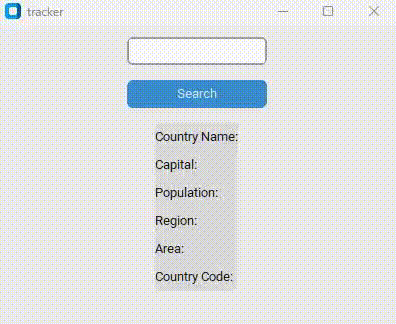

# Country 🌍 Tracker 

In this Python project, the main purpose is to collect data from the REST Countries API (https://restcountries.com/) and use it to display information about a country based on the user's input. By entering the name of a country, the project will make an API request to retrieve relevant data such as the country's capital, population, region, subregion, and languages spoken.

To implement this project, we will utilize the requests library in Python. This library allows us to send HTTP requests and handle the API responses. With the retrieved data, we can then present it in a user-friendly format to provide insights about the selected country.

| Software | API |
| --- | --- |
|  |  |


## Tools Used

Here are the tools used in the development of the Project Tracker:

- 📅 [Monday](https://monday.com): A project management tool used to fetch project data and update the tracker.

- 🧜‍♀️ [Mermaid.js](https://mermaid-js.github.io/mermaid/): A JavaScript library used for visualizing project progress and generating insightful reports.

- 🐍 [Python](https://www.python.org/): The programming language used for building the Project Tracker.

- ✨ [VS Code](https://code.visualstudio.com/): A popular code editor used for developing and customizing the project tracker.

## Requirements

✅ Before using the Tracker, ensure that you have the following requirements met:

- ⚙️ Python 3.11.4 installed on your system.

- 🌐 Internet connection
## How to Use

1. Clone the repository:
```shell
git clone https://github.com/devkond/countryTracker.git
```
2. Navigate to the project directory:
```shell
cd countryTracker
```
3. Set up a virtual environment using venv:
```shell
python -m venv venv
```
4. Activate the virtual environment:
- On Windows:
  ```
  venv\Scripts\activate
  ```
- On macOS and Linux:
  ```
  source venv/bin/activate
  ```
5. Install the required dependencies:
```shell
pip install -r requirements.txt
```
6. Run the tracker:
```shell
python tracker.py
```

# Developers
* [devkond](https://github.com/devkond)
